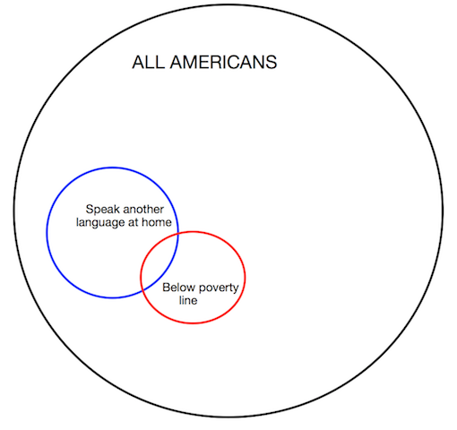

```{r setup, include=FALSE}
knitr::opts_chunk$set(echo = TRUE)
```

## Problems

####2.6
Dice rolls. If you roll a pair of fair dice, what is the probability of
  
  (a) getting a sum of 1?
  
  The probablility of rolling a sum of 1 with a pair of dice is 0. The lowest sum you could roll with a pair of dice is 2.
  
  (b) getting a sum of 5?
  
  There are 4 ways of getting a sum of 5: $(1,4),(2,3),(3,2),(4,1)$ out of $6^2$ outcomes. Therefore the probability is: $\frac{5}{36}$.
  
  (c) getting a sum of 12?
  
  There is only one way to get a sum of 12, and that is with both dice rolling a 6. Therefore there is a $\frac{1}{36}$ probability of getting a sum of 12.

***

####2.8
Poverty and language. The American Community Survey is an ongoing survey that provides data every year to give communities the current information they need to plan investments and services. The 2010 American Community Survey estimates that 14.6% of Americans live below the poverty line, 20.7% speak a language other than English (foreign language) at home, and 4.2% fall into both categories.

  (a) Are living below the poverty line and speaking a foreign language at home disjoint?
  
  **No**, they are not disjoint. As per above, 4.2% Americans fall into both categories.
  
  (b) Draw a Venn diagram summarizing the variables and their associated probabilities.

  
  
  (c) What percent of Americans live below the poverty line and only speak English at home?
  
  We subtract the portion of Americans who speak a foreign language from those who are below the poverty line. So, 14.6% - 4.2% = **10.4%**.
  
  (d) What percent of Americans live below the poverty line or speak a foreign language at home?
  
  If $A$ = Americans living below the poverty line, and $B$ represents Americans who speak a foreign language at home, then we need to find $A\cup B$ which is equal to $A + B - A\cap B = 14.6 + 20.7 - 4.2 = 31.1$. So, the answer is **31.1%**.
  
  (e) What percent of Americans live above the poverty line and only speak English at home?
  
  This is simply **4.2%**
  
  (f) Is the event that someone lives below the poverty line independent of the event that the person speaks a foreign language at home?
  
  **No**. These events are not independent. An independent event is defined as events where this statement is true: $P(A)\cap P(B)=P(A)P(B)$. Here we see $0.146 * 0.207 \neq 0.042$.
  
***

####2.20
Assortative mating. Assortative mating is a nonrandom mating pattern where individuals with similar genotypes and/or phenotypes mate with one another more frequently than what would be expected under a random mating pattern. Researchers studying this topic collected data on eye colors of 204 Scandinavian men and their female partners. The table summarizes the results. For simplicity, we only include heterosexual relationships in this exercise.

(a) What is the probability that a randomly chosen male respondent or his partner has blue eyes?

  Because a male and female eye colors are independent from one another, the probability of $P(M_{bl}) \cup P(F_{bl}) = P(M_{bl}) + P(F_{bl}) - P(M_{bl})\cap P(F_{bl})= \frac{114}{204} + \frac{108}{204} - \frac{78}{204}$ or approximately **`r round((114/204 + 108/204) - (78/204),2)`**.

(b) What is the probability that a randomly chosen male respondent with blue eyes has a partner with blue eyes?

  The probability is $\frac{78}{114}$ or approximately **`r round(78/114,2)`**.

(c) What is the probability that a randomly chosen male respondent with brown eyes has a partner with blue eyes? What about the probability of a randomly chosen male respondent with green eyes having a partner with blue eyes?

  The probability of a randomly chosen male respondent with brown eyes having a partner with blue eyes is $\frac{19}{54}$ or about **`r round(19/54,2)`**. The probability of a randomly chosen male respondent with green eyes having a partner with blue eyes is $\frac{11}{36}$ or approximately **`r round(11/36,2)`**.

(d) Does it appear that the eye colors of male respondents and their partners are independent? Explain your reasoning.

  The eye colors are **not independent** of one another. First, it's feasible to believe that people may have a preference for someone with the same eye color as their own. Secondly, the formula for determining independence is not true: $P(M_{bl})\cap P(F_{bl})=P(M_{bl})P(F_{bl})$, $\frac{78}{204} \neq \frac{114}{204} * \frac{108}{204}$.

***

####2.30
Books on a bookshelf. The table shows the distribution of books on a bookcase
based on whether they are nonfiction or fiction and hardcover or paperback.

(a) Find the probability of drawing a hardcover book first then a paperback fiction book second when drawing without replacement.

  The total probability is $\frac{28}{95} * \frac{59}{94}$ or approximately **`r round((28/95)*(59/94),2)`**.

(b) Determine the probability of drawing a fiction book first and then a hardcover book second, when drawing without replacement.

  Since we are drawing without replacement, it is possible that we draw a *hardcover* fiction book first, thus altering the probability of getting a hardcover book on the second draw. In other words, our second draw is not independent so we cannot simply multiply their individual probabilities.
  
  $P($hardcover fiction$) = \frac{13}{95}$,
  $P($softcover fiction$) = \frac{59}{95}$,
  $P($hardcover|hardcover fiction$) = \frac{27}{94}$,
  $P($hardcover|softcover fiction$) = \frac{28}{94}$.

  $P($fiction and hardcover$) = (\frac{13}{95} \times \frac{27}{94}) + (\frac{59}{95} \times \frac{28}{94}) =$ **`r round(((13/95)*(27/94))+((59/95)*(28/94)),3)`**.

(c) Calculate the probability of the scenario in part (b), except this time complete the calculations under the scenario where the first book is placed back on the bookcase before randomly drawing the second book.

  Unlike in (b) above, the first draw does not impact the second draw because replacement is used. So, the probability is simply $\frac{72}{95} \times \frac{28}{95} =$ **`r round((72/95)*(28/95),3)`**.

(d) The final answers to parts (b) and (c) are very similar. Explain why this is the case.

  The answers are similar because replacement/non-replacement only impacted 1 of 95 books, a small enough change in denominator to keep the probabilities close.
  
***

####2.38
An airline charges the following baggage fees: \$25 for the first bag and \$35 for the second. Suppose 54% of passengers have no checked luggage, 34% have one piece of checked luggage and 12% have two pieces. We suppose a negligible portion of people check more than two bags.

(a) Build a probability model, compute the average revenue per passenger, and compute the corresponding standard deviation.

```{r}

# Values of each possible outcome of X
x0 <- 0
x1 <- 25
x2 <- 60

# Probabilities of each occurring
p0 <- 0.54
p1 <- 0.34
p2 <- 0.12

# Expected value of each outcome
E0 <- x0 * p0
E1 <- x1 * p1
E2 <- x2 * p2

# Expected value per passenger
Etotal = E0 + E1 + E2

# Variances
var0 <- ((x0-Etotal)^2) * p0
var1 <- ((x1-Etotal)^2) * p1
var2 <- ((x2-Etotal)^2) * p2

SDtotal <- sqrt(var0+var1+var2)
```

  The average revenue per passenger would be **\$`r round(Etotal,2)`** with a standard deviation of **\$`r round(SDtotal,2)`**.

(b) About how much revenue should the airline expect for a flight of 120 passengers? With what standard deviation? Note any assumptions you make and if you think they are justified.

  The airline shold expect about **\$`r round(Etotal * 120,2)`** for a flight of 120 passengers with a standard deviation of \$`r round(SDtotal * 120,2)`. This is assuming that there is independence between passengers' baggage needs; that will not necessarily be true, as people traveling together will be more likely to need similar numbers of bags.

***

####2.44
Income and gender. The relative frequency table displays the distribution of annual total personal income (in 2009 inflation-adjusted dollars) for a representative sample of 96,420,486 Americans. These data come from the American Community Survey for 2005-2009. This sample is comprised of 59% males and 41% females.

(a) Describe the distribution of total personal income.

```{r}
library(ggplot2)
prob <- c(0.022,0.047,0.158,0.183,0.212,0.139,0.058,0.084,
          0.097)
income <- ordered(c("0-10","10-15","15-25","25-35","35-50","50-65",
                    "65-75","75-100","100+"), 
                  levels=c("0-10","10-15","15-25","25-35","35-50",
                           "50-65","65-75","75-100","100+"))

data <- data.frame(prob,income)
colnames(data) <- c("Percentage","Income")

ggplot(data, aes(Income,Percentage)) +
  geom_col(fill="darkolivegreen") + 
  xlab("Income (1,000's of dollars)")
```

  The distribution, at first glance appears bi-modal. However, the last category is all incomes of \$100,000 or above, so this actually extends the right tail considerably. This presents a very positively-skewed distribution. The median value lies somewhere in the 35-50k range.

(b) What is the probability that a randomly chosen US resident makes less than \$50,000 per year?

  The probability is approximately **`r sum(data[1:5,1])`**.

(c) What is the probability that a randomly chosen US resident makes less than $50,000 per year and is female? Note any assumptions you make.

  Assuming that income and gender are independent (which they are not in reality!), the probability would be 0.41 $\times$ `r sum(data[1:5,1])` = **`r round(0.41 * sum(data[1:5,1]),2)`**.

(d) The same data source indicates that 71.8% of females
make less than $50,000 per year. Use this value to determine whether or not the assumption you made in part (c) is valid.

  Since only `r sum(data[1:5,1]) * 100`% of *all Americans* earn under \$50k, and females make up the smaller portion of that sample (41%), it only stands to reason that **there are considerably more females earning under \$50k than males**. This confirms the statement in (c) above that gender and income are not independent.
