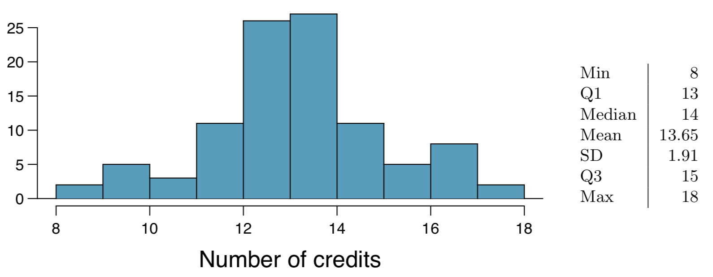

```{r setup, include=FALSE}
knitr::opts_chunk$set(echo = TRUE)
```

##Chapter 4 Exercises


### 4.3 - College credits. A college counselor is interested in estimating how many credits a student typically enrolls in each semester. The counselor decides to randomly sample 100 students by using the registrar’s database of students. The histogram below shows the distribution of the number of credits taken by these students. Sample statistics for this distribution are also provided.



####(a) What is the point estimate for the average number of credits taken per semester by students at this college? What about the median?

The point estimate for average number of credits taken per semester per student is 13.65, while the median is 14.

####(b) What is the point estimate for the standard deviation of the number of credits taken per semester by students at this college? What about the IQR?

The point estimate for the standard deviation is 1.91 credits. The IQR equals $15-13=2$.

####(c) Is a load of 16 credits unusually high for this college? What about 18 credits? Explain your reasoning. Hint: Observations farther than two standard deviations from the mean are usually considered to be unusual.

16 credits is `r round((16-13.65)/1.91,1)` standard deviations from the mean. Using the 68-95-99 rule, this is not too unusual. However 18 credits is `r round((18-13.65)/1.91,1)` standard deviations from the mean, which is way more unusual.

####(d) The college counselor takes another random sample of 100 students and this time finds a sample mean of 14.02 units. Should she be surprised that this sample statistic is slightly different than the one from the original sample? Explain your reasoning.

No, this is not cause for alarm. Each sample is random and thus would get different values each time and typically a different mean (and median, standard deviation, etc.).

####(e) The sample means given above are point estimates for the mean number of credits taken by all students at that college. What measures do we use to quantify the variability of this estimate? (Hint: recall that $SD_{\bar{x}}=\frac{\sigma}{\sqrt{n}}$)? Compute this quantity using the data from the original sample.

We quantify the variability of the estimate using the **standard error**. This is equal to the standard deviation of the distribution of sample means (i.e. $\frac{\sigma}{\sqrt{n}}$). In this case, the standard error is $\frac{1.91}{\sqrt{10}}$ or `r round(1.91/(sqrt(10)),2)`. From this we could construct confidence intervals.

***

### 4.13 - Waiting at an ER, Part I. A hospital administrator hoping to improve wait times decides to estimate the average emergency room waiting time at her hospital. She collects a simple random sample of 64 patients and determines the time (in minutes) between when they checked in to the ER until they were first seen by a doctor. A 95% confidence interval based on this sample is (128 minutes, 147 minutes), which is based on the normal model for the mean. Determine whether the following statements are true or false, and explain your reasoning.

####(a) This confidence interval is not valid since we do not know if the population distribution of the ER wait times is nearly Normal.

False. As long as the population is not strongly skewed, observations are independent, and the sample size is sufficient (more than 30 or so), then the distribution of the sample means should be nearly normal.

####(b) We are 95% confident that the average waiting time of these 64 emergency room patients is between 128 and 147 minutes.

False. The mean of these specific 64 patients' waiting times was used to construct this confidence interval, so we are 100% sure that this sample's mean is in the interval.

####(c) We are 95% confident that the average waiting time of all patients at this hospital’s emergency room is between 128 and 147 minutes.

True. This is the definition of a confidence interval. Since the distribution of sample means is nearly normal, this interval should cover about 95% of the means we'd get from all samples of size 64. Those means are, unbiased estimates of the population mean.

####(d) 95% of random samples have a sample mean between 128 and 147 minutes.

False. Only those samples of size 64 would be 95% likely to fall in this interval.

####(e) A 99% confidence interval would be narrower than the 95% confidence interval since we need to be more sure of our estimate.

False. A 99% confidence interval is like casting a wider net to be more sure we're estimating the population parameter. Therefore, it would be a wider interval.

####(f) The margin of error is 9.5 and the sample mean is 137.5.

True. The sample mean will be midway in the confidence interval: $\frac{(147 + 128)}{2} = 137.5$. The standard error is how far each endpoint of the interval is from the sample mean: $147 - 137.5 = 9.5$.

####(g) In order to decrease the margin of error of a 95% confidence interval to half of what it is now, we would need to double the sample size.

False. Because the denominator of the standard error calculation is the square root of the sample size, to double it you would need *four times* as many samples.

***

### 4.23 - Nutrition labels. The nutrition label on a bag of potato chips says that a one ounce (28 gram) serving of potato chips has 130 calories and contains ten grams of fat, with three grams of saturated fat. A random sample of 35 bags yielded a sample mean of 134 calories with a standard deviation of 17 calories. Is there evidence that the nutrition label does not provide an accurate measure of calories in the bags of potato chips? We have verified the independence, sample size, and skew conditions are satisfied.

Our standard error for this observation is `r se <- round(17/sqrt(35),2)
se`. A 95% confidence interval would be 1.96 standard errors from the sample mean or between `r 134 - (1.96*se)` and `r 134 + (1.96*se)`. Since 130 lies in this range, there isn't sufficient evidence to think that the label is inaccurate.

***

### 4.25 - Waiting at an ER, Part III. The hospital administrator mentioned in Exercise 4.13 randomly selected 64 patients and measured the time (in minutes) between when they checked in to the ER and the time they were first seen by a doctor. The average time is 137.5 minutes and the standard deviation is 39 minutes. She is getting grief from her supervisor on the basis that the wait times in the ER has increased greatly from last year’s average of 127 minutes. However, she claims that the increase is probably just due to chance.

####(a) Are conditions for inference met? Note any assumptions you must make to proceed.

It is unclear if all of the conditions are met. Independence, for example, is not clear: When were the samples taken? Were the patients chosen at random throughout the day? We have to assume this, however, in order to continue.

####(b) Using a significance level of $\alpha = 0.05$, is the change in wait times statistically significant? Use a two-sided test since it seems the supervisor had to inspect the data before she suggested an increase occurred.

Here the null hypothesis is $H_0: \mu = 127$, and the alternative hypothesis is $H_A: \mu \ne 127$. Given the standard deviation of the sample as $s=39$ and observed sample mean of $\bar{x}=137.5$. Standard error for this sample would be `r se <- 39/sqrt(64)
se`. So our observed value of 137.5 is $\frac{137.5 - 127}{`r se`} = `r z <- round((137.5-127)/se,2)
z`$ standard deviations above the mean. The associated p-value is `r round(2 * pnorm(z,0,1,lower.tail=FALSE),2)` which is sufficient evidence to reject the null hypothesis at $\alpha = 0.05$.

####(c) Would the conclusion of the hypothesis test change if the significance level was changed to $\alpha = 0.01$?

Yes. The p-value would not be significant enough to reject the null hypothesis with a smaller alpha. In other words, the sample mean would have had to have been more extreme to provide compelling evidence in the supervisor's favor.

***

### 4.39 - Weights of pennies. The distribution of weights of United States pennies is approximately normal with a mean of 2.5 grams and a standard deviation of 0.03 grams.

####(a) What is the probability that a randomly chosen penny weighs less than 2.4 grams?

The probability is `r format(round(pnorm(2.4,2.5,0.03),4),scientific=FALSE)`.

####(b) Describe the sampling distribution of the mean weight of 10 randomly chosen pennies.

The sampling distribution should be nearly normal with a standard deviation of `r round(0.03/sqrt(10),2)`

####(c) What is the probability that the mean weight of 10 pennies is less than 2.4 grams?

The probability is `r format(pnorm(2.4,2.5,0.01),scientific=TRUE)`.

####(d) Sketch the two distributions (population and sampling) on the same scale.

```{r}
library(ggplot2)

#population
x = seq(2.3,2.7,0.001)

ggplot(data.frame(x), aes(x)) + stat_function(fun=dnorm, args = list(mean = 2.5, sd = 0.03)) +
  ggtitle("Population") + xlab("Weight (grams)") + ylab("") + scale_y_continuous(breaks=FALSE) + xlim(2.3,2.7)

#sample
sample <- rep(0,1000)

for(i in 1:10000){
  sample[i] <- mean(rnorm(10,mean=2.5,sd=0.03))
}

ggplot(data.frame(sample), aes(sample)) + geom_density() +
  ggtitle("Sample") + xlab("Mean Weight (grams)") + ylab("") +   
  scale_y_continuous(breaks=FALSE) + xlim(2.3,2.7)

```

####(e) Could you estimate the probabilities from (a) and (c) if the weights of pennies had a skewed distribution?

Yes, if we had a large enough sample, we could get reasonably accurate estimates.

***

### 4.47 - Practical vs. statistical. Determine whether the following statement is true or false, and explain your reasoning: “With large sample sizes, even small differences between the null value and the point estimate can be statistically significant.”

True. Taking the penny example from 4.39 above, if we look at increasing the size of the samples, the distribution narrows. This causes the same deviation to hold a smaller and smaller p-value each time.

```{r}

sample10 <- rep(0,10000)
sample50 <- rep(0,10000)
sample500 <- rep(0,10000)


for(i in 1:10000){
    sample10[i] <- mean(rnorm(10,mean=2.5,sd=0.03))
}

for(i in 1:10000){
    sample50[i] <- mean(rnorm(50,mean=2.5,sd=0.03))
}

for(i in 1:10000){
    sample500[i] <- mean(rnorm(500,mean=2.5,sd=0.03))
}

ggplot() + geom_density(data=data.frame(sample10), aes(x=sample10), col="green") +
  geom_density(data=data.frame(sample50),aes(x=sample50), col="orange") +
  geom_density(data=data.frame(sample500),aes(x=sample500), col="red") +
  geom_label(aes(x=2.480,y=30),label="n=10", fill="green")+
  geom_label(aes(x=2.490,y=80),label="n=50", fill="orange")+
  geom_label(aes(x=2.499,y=150),label="n=500", fill="red")+
  ggtitle("Samples") + xlab("Mean Weight (grams)") + ylab("") +
  scale_y_continuous(breaks=FALSE) + xlim(2.45,2.55)

```

