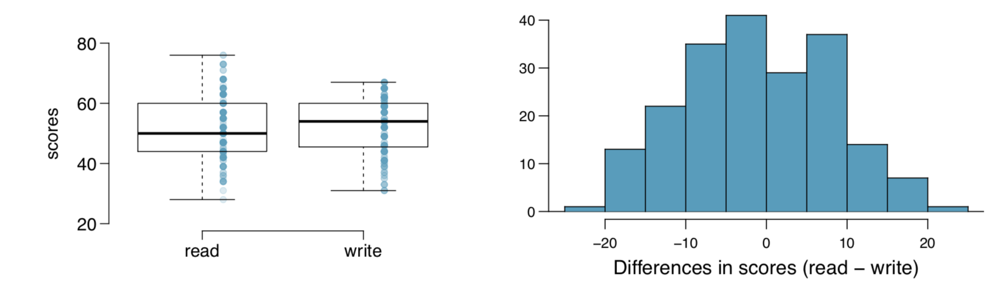
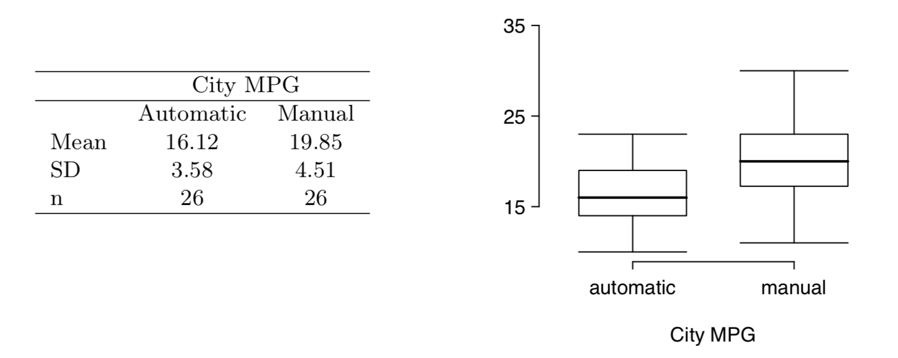
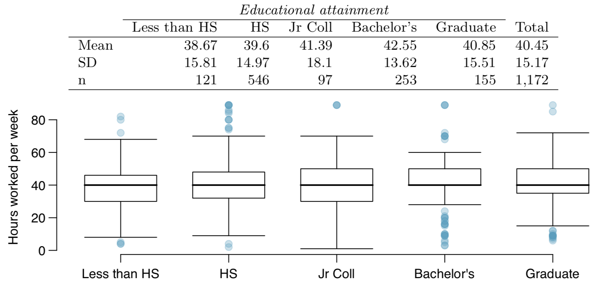

```{r setup, include=FALSE}
knitr::opts_chunk$set(echo = TRUE)
library(tidyverse)
```

#### 5.6 - Working backwards, Part II. A 90% confidence interval for a population mean is (65, 77). The population distribution is approximately normal and the population standard deviation is unknown. This confidence interval is based on a simple random sample of 25 observations. Calculate the sample mean, the margin of error, and the sample standard deviation.

A confidence interval will be symmetrical about the sample mean, therefore the sample mean ($\bar{x}$) that was observed is 71.

```{r}
# Degrees of freedom = n-1
df <- 24

# t-value for 90% CI
t <- abs(qt(0.05,df))

# The interval was constructed by adding/subtracting 6 to the sample mean
SE <- 6/t

s <- SE * sqrt(25)
```

The standard error is `r SE` and the sample standard deviation is `r s`.

***

####5.14 - SAT scores. SAT scores of students at an Ivy League college are distributed with a standard deviation of 250 points. Two statistics students, Raina and Luke, want to estimate the average SAT score of students at this college as part of a class project. They want their margin of error to be no more than 25 points.

#####(a) Raina wants to use a 90% confidence interval. How large a sample should she collect?

```{r}
z <- abs(qnorm(0.05,0,1))

SE <- 25 / z

n <- ceiling((250 / SE)^2)
```

To get the desired margin of error at the 90% confidence interval, Raina would need a sample size of at least `r n`.

#####(b) Luke wants to use a 99% confidence interval. Without calculating the actual sample size, determine whether his sample should be larger or smaller than Raina’s, and explain your reasoning.

Luke would need a larger sample size to get the same margin of error because the Z value would be larger for a 99% confidence interval so the SE would need to be lower. Since the population standard deviation stays the same, the sample size needs to be larger.

#####(c) Calculate the minimum required sample size for Luke.

```{r}
z <- abs(qnorm(0.005,0,1))

SE <- 25 / z

n <- ceiling((250 / SE)^2)
```

Luke's sample size would need to be `r n`.

***

####5.20 - High School and Beyond, Part I. The National Center of Education Statistics conducted a survey of high school seniors, collecting test data on reading, writing, and several other subjects. Here we examine a simple random sample of 200 students from this survey. Side-by-side box plots of reading and writing scores as well as a histogram of the differences in scores are shown below.



#####(a) Is there a clear difference in the average reading and writing scores?

From the given plots, it does appear that there may be a significant difference between reading and writing scores.

#####(b) Are the reading and writing scores of each student independent of each other?

I would hypothesize that reading and writing scores are *not* independent from one another.

#####(c) Create hypotheses appropriate for the following research question: is there an evident difference in the average scores of students in the reading and writing exam?

Our hypothesis would be: $H_0:\mu_{\text{reading}} = \mu_{\text{writing}}$ and $H_A:\mu_{\text{reading}}\ne\mu_{\text{writing}}$.

#####(d) Check the conditions required to complete this test.

First we check normality. The distributions appear somewhat normal with a small skew. Since we have a sample of 200, such a small skew should not cause issues. Finally, we cannot check independence. I would suggest that reading score and writing score are related and thus not independent.

#####(e) The average observed difference in scores is $\bar{x}_{\text{read - write}} = -0.545$, and the standard deviation of the differences is 8.887 points. Do these data provide convincing evidence of a difference between the average scores on the two exams?

```{r}
SE <- 8.887 / sqrt(200)

t <- (-0.545 - 0)/SE

p <- pt(t, 199)
```

No. The t score we calculate is small and its associated p-value is only `r round(p,2) `. Thus, we do not observe sufficient evidence to conclude that there is a difference between the means.

#####(f) What type of error might we have made? Explain what the error means in the context of the application.

We could have made a Type II error. In other words we may have concluded that there was no difference difference when there was one, and failed to reject a false null hypothesis. In other words, we may have failed to detect a real difference.

#####(g) Based on the results of this hypothesis test, would you expect a confidence interval for the average difference between the reading and writing scores to include 0? Explain your reasoning.

Yes, because we failed to see a significant enough difference in observed means to indicate a true difference exists. Thus, zero (no difference) should be in any reasonable confidence interval.

***

####5.32 - Fuel efficiency of manual and automatic cars, Part I. Each year the US Environ- mental Protection Agency (EPA) releases fuel economy data on cars manufactured in that year. Below are summary statistics on fuel efficiency (in miles/gallon) from random samples of cars with manual and automatic transmissions manufactured in 2012. Do these data provide strong evidence of a difference between the average fuel efficiency of cars with manual and automatic transmissions in terms of their average city mileage? Assume that conditions for inference are satisfied.



First, we can assume independence, since these are different cars and a random sample taken from all cars. The graphs show little skew and a symmetric distribution, so normality can be assumed. The sample sizes are a bit low, but sufficient for the low skew we have.

We will use an alpha level of $\alpha=0.05$ to conduct a hypothesis test. Our null hypothesis is: $H_0:\mu_{\text{diff}} = 0$ and $H_A:\mu_{\text{diff}}\ne0$.

```{r}
meanA <- 16.12
meanB <- 19.85

diff <- 19.85 - 16.12

sdA <- 3.58
varA <- sdA^2

sdB <- 4.51
varB <- sdB^2

nA <- 26
nB <- 26

SE <- sqrt((varA/nA)+(varB/nB))

t <- diff/SE

p <- pt(t,24, lower.tail = FALSE)
```

Since our p-value is less than an alpha of 0.05, we can conclude that there is sufficient evidence to reject our null hypothesis at $\alpha=0.05$.

***

####5.48 - Work hours and education. The General Social Survey collects data on demographics, education, and work, among many other characteristics of US residents.47 Using ANOVA, we can consider educational attainment levels for all 1,172 respondents at once. Below are the distributions of hours worked by educational attainment and relevant summary statistics that will be helpful in carrying out this analysis.



#####(a) Write hypotheses for evaluating whether the average number of hours worked varies across the five groups.

$H_0:\mu_{\text{Less Than HS}}=\mu_{\text{HS}}=\mu_{\text{Jr Coll}}=\mu_{\text{Bachelor's}}=\mu_{\text{Graduate}}$ and $H_A:\text{At least one mean is different}$.

#####(b) Check conditions and describe any assumptions you must make to proceed with the test.

The graphs show some outliers which may skew the distribution somewhat, however we have large sample sizes for each. It is also reasonable to assume independence since the degree represents the highest attained. Most importantly, the variances seem to be somewhat similar to one another.

#####(c) Below is part of the output associated with this test. Fill in the empty cells.

```{r}
MSG <- 501.54

SSG <- 4 * 501.54
```

X        |Df  |Sum Sq |Mean Sq|F value|Pr(>F)
---------|----|-------|-------|------|------
degree   |4   |`r SSG`|501.54 |0.212 |0.0682
Residuals|1167|267,382|229.12 |
Total    |    |       |

#####(d) What is the conclusion of the test?

The conclusion is that there is not enough evidence to reject the null hypothesis at $\alpha=0.05$.