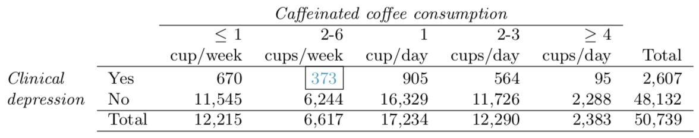

```{r setup, include=FALSE}
knitr::opts_chunk$set(echo = TRUE)
```

####6.6 - 2010 Healthcare Law.
**On June 28, 2012 the U.S. Supreme Court upheld the much debated 2010 healthcare law, declaring it constitutional. A Gallup poll released the day after this decision indicates that 46% of 1,012 Americans agree with this decision. At a 95% confidence level, this sample has a 3% margin of error. Based on this information, determine if the following statements are true or false, and explain your reasoning.**

**(a) We are 95% confident that between 43% and 49% of Americans in this sample support the decision of the U.S. Supreme Court on the 2010 healthcare law.**

This is not true. The sample percent is 46%.

**(b) We are 95% confident that between 43% and 49% of Americans support the decision of the U.S. Supreme Court on the 2010 healthcare law.**

This is true. The confidence interval represents the range we expect the population parameter to be with a given confidence.

**(c) If we considered many random samples of 1,012 Americans, and we calculated the sample proportions of those who support the decision of the U.S. Supreme Court, 95% of those sample proportions will be between 43% and 49%.**

Approximately this is true. We'd expecct around 95% of the sample proportions to be between 43% and 49%.

**(d) The margin of error at a 90% confidence level would be higher than 3%.**

False. A lower confidence level typically means a smaller margin of error.

***

###6.12 Legalization of marijuana, Part I.
**The 2010 General Social Survey asked 1,259 US residents: “Do you think the use of marijuana should be made legal, or not?” 48% of the respondents said it should be made legal.**

**(a) Is 48% a sample statistic or a population parameter? Explain.**

This is a sample statistic. The text states, "48% of respondents..." so they are only summarizing the sample they took.

**(b) Construct a 95% confidence interval for the proportion of US residents who think marijuana should be made legal, and interpret it in the context of the data.**

```{r}
b <- prop.test(ceiling(0.48*1259),1259,0.48)

paste(round(b$conf.int[1] * 100,1),"% - ",round(b$conf.int[2] * 100,1),"%",sep="")
```

**(c) A critic points out that this 95% confidence interval is only accurate if the statistic follows a normal distribution, or if the normal model is a good approximation. Is this true for these data? Explain.**

This is a true statement.

With this particular data we'd have to be assured of independence amongst respondents. Unless the methodology for this survey was purposefully flawed (e.g. sampling only people entering or leaving marijuana stores in states where it is legal), it is likely independent. Also, we'd have to be assured that the success-failure condition is satisfied (which, if $\hat{p}$ = 48%, it obviously is). So, the confidence interval calculated should be reasonably accurate.

**(d) A news piece on this survey’s findings states, “Majority of Americans think marijuana should be legalized.” Based on your confidence interval, is this news piece’s statement justified?**

No, I think that this statement would be misleading. A more appropriate headline would read, "Nearly half of all Americans..."

***

###6.20 Legalize Marijuana, Part II.
**As discussed in Exercise 6.12, the 2010 General Social Survey reported a sample where about 48% of US residents thought marijuana should be made legal. If we wanted to limit the margin of error of a 95% confidence interval to 2%, about how many Americans would we need to survey?**

$$Z\times\sqrt{\frac{p(1-p)}{n}}=\text{error}$$
$$1.96\times\sqrt{\frac{0.48(0.52)}{n}}=0.02$$
$$3.8416\times\frac{0.2496}{n}=0.0004$$

```{r}
ceiling((3.8416*0.2496)/0.0004)
```

***

###6.28 Sleep deprivation, CA vs. OR, Part I.
**According to a report on sleep deprivation by the Centers for Disease Control and Prevention, the proportion of California residents who reported insufficient rest or sleep during each of the preceding 30 days is 8.0%, while this proportion is 8.8% for Oregon residents. These data are based on simple random samples of 11,545 California and 4,691 Oregon residents. Calculate a 95% confidence interval for the difference between the proportions of Californians and Oregonians who are sleep deprived and interpret it in context of the data.**

$$SE=\sqrt{\frac{0.08(0.92)}{11545}+\frac{0.088(0.0912)}{4691}}$$
```{r}
SE <- sqrt(((0.08*0.92)/11545)+((0.088*0.0912)/4691))

margin <- 1.96 * SE

ci1 <- 0.008 - margin
ci2 <- 0.008 + margin
paste("Confidence interval of the difference: (",
      round(ci1*100,2),"%, ",
      round(ci2*100,2),"%)",sep="")
```

***

###6.44 Barking deer.
**Microhabitat factors associated with forage and bed sites of barking deer in Hainan Island, China were examined from 2001 to 2002. In this region woods make up 4.8% of the land, cultivated grass plot makes up 14.7% and deciduous forests makes up 39.6%. Of the 426 sites where the deer forage, 4 were categorized as woods, 16 as cultivated grassplot, and 61 as deciduous forests. The table below summarizes these data.**

Woods | Cultivated grassplot | Deciduous forests | Other | Total
------|----------------------|-------------------|-------|------
4     |            16        |        67         |  345  |  426

**(a) Write the hypotheses for testing if barking deer prefer to forage in certain habitats over others.**
$$H_0:\text{All proportions are equal} \text{  ;  } H_A:\text{The proportions are unequal}$$

**(b) What type of test can we use to answer this research question?**

We would use a chi-square test.

**(c) Check if the assumptions and conditions required for this test are satisfied.**

First we must check for independence. It appears that each area is only counted once, so that should suffice for independence. We also need to check and see if each outcome has at least a count of 5. We're shy of that for the "Woods" category, but may still be able to proceed.

**(d) Do these data provide convincing evidence that barking deer prefer to forage in certain habitats over others? Conduct an appropriate hypothesis test to answer this research question.)**

```{r}
obsWoods <- 4/426
obsGrass <- 16/426
obsForest <- 67/426
obsOther <- 345/426
obsTotal <- c(obsWoods,obsGrass,obsForest,obsOther)

popWoods <- 0.048
popGrass <- 0.147
popForest <- 0.396
popOther <- 1 - (popWoods + popGrass + popForest)
popTotal <- c(popWoods, popGrass, popForest, popOther)

chisq.test(obsTotal, popTotal)
```

The results of the test indicate that there is insufficient evidence to reject the null hypothesis. Therefore there is no evidence that barking deer perfer one type of grazing land over another.

***

###6.48 Coffee and Depression.
**Researchers conducted a study investigating the relationship between caffeinated coffee consumption and risk of depression in women. They collected data on 50,739 women free of depression symptoms at the start of the study in the year 1996, and these women were followed through 2006. The researchers used questionnaires to collect data on caffeinated coffee consumption, asked each individual about physician-diagnosed depression, and also asked about the use of antidepressants. The table below shows the distribution of incidences of depression by amount of caffeinated coveffe consumption.**


**(a) What type of test is appropriate for evaluating if there is an association between coffee intake and depression?**

A chi-square test with a two-way table is most appropriate here.

**(b) Write the hypotheses for the test you identified in part (a).**

$$H_0:\text{The proportion of clinical depression does not change with coffee consumption}\\
H_A:\text{The proportion of clinical depression does change with coffee consumption}$$

**(c) Calculate the overall proportion of women who do and do not suffer from depression.**

```{r}
depress <- 2607/50739
notDepress <- 48132/50739

paste("Depressed: ",round(depress,3),", Not Depressed: ",
      round(notDepress,3),sep="")
```

**(d) Identify the expected count for the highlighted cell, and calculate the contribution of this cell to the test statistic, i.e. $\text{(Observed - Expected)}^2\text{/Expected}$.**

The expected count for that cell is:
```{r}
expected <- ceiling((2607 * 6617)/50739)
expected
```

The amount it contributes to the $\chi^2$ test statistic is:
```{r}
(373 - expected)^2/expected
```

**(e) The test statistic is $\chi^2$ = 20.93. What is the p-value?**
```{r}
p <- pchisq(20.93,4,lower.tail = FALSE)
paste("p = ",round(p,5),sep="")
```

**(f) What is the conclusion of the hypothesis test?**

The conclusion is that there is evidence that there is indeed a difference.

**(g) One of the authors of this study was quoted on the NYTimes as saying it was “too early to recommend that women load up on extra coffee” based on just this study. Do you agree with this statement? Explain your reasoning.**

Yes. This doesn't necessarily show any relationship in terms of causality.

***
