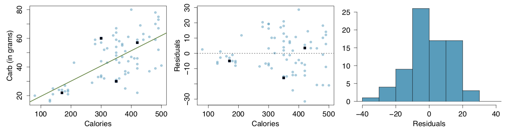
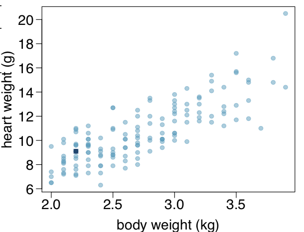
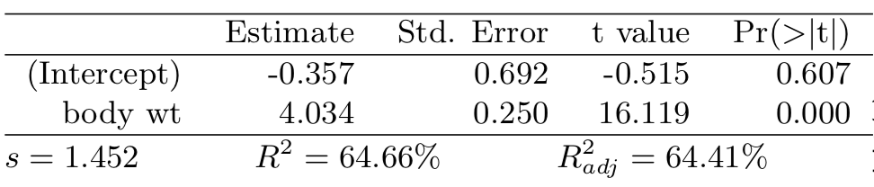
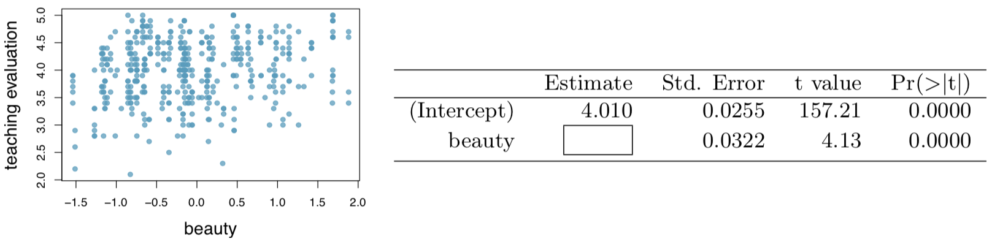
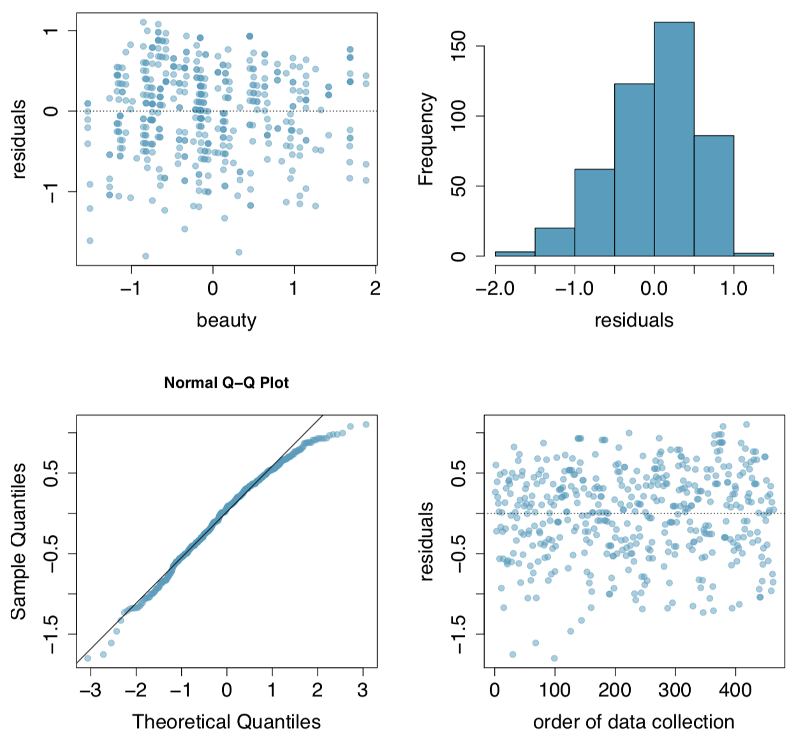

```{r setup, include=FALSE}
knitr::opts_chunk$set(echo = TRUE)
library(knitr)
```

###7.24 - Nutrition at Starbucks, Part I.
**The scatterplot below shows the relationship between the number of calories and amount of carbohydrates (in grams) Starbucks food menu items contain. Since Starbucks only lists the number of calories on the display items, we are interested in predicting the amount of carbs a menu item has based on its calorie content.**



**(a) Describe the relationship between number of calories and amount of carbohydrates (in grams) that Starbucks food menu items contain.**

The relationship between calories and carbohydrates is not really linear. Despite the line, there doesn't appear to be a strong linear relationship.

**(b) In this scenario, what are the explanatory and response variables?**

In this scenario, the explanatory variable is calories, and the response variable is carbohydrates.

**(c) Why might we want to fit a regression line to these data?**

We may choose to fit a regression line to these data in order to show that there is a linear relationship between calories and carbohydrates (though here there doesn't appear to be much of one) or to potentially predict a new item on the menu's carbohydrate level based on calories.

**(d) Do these data meet the conditions required for fitting a least squares line?**

No, they do not. The relationship does not appear linear, and there does not appear to be constant variability.

***

###7.26 - Body measurements, Part III.
**Exercise 7.15 introduces data on shoulder girth and height of a group of individuals. The mean shoulder girth is 107.20 cm with a standard deviation of 10.37 cm. The mean height is 171.14 cm with a standard deviation of 9.41 cm. The correlation between height and shoulder girth is 0.67.**

**(a) Write the equation of the regression line for predicting height.**

To estimate the slope, we use $\beta_1=\frac{s_y}{s_x}\times R$. We can then use the equation $y-y_0=\beta_1(x-x_0)$ to get the equation:

```{r} 
slope <- round(9.41/10.37*0.67,2)
intercept <- (slope * -107.20) + 171.14
```

$$(y-171.14) = `r slope` (x-107.20)$$

$$y = `r slope` x + `r intercept`$$

**(b) Interpret the slope and the intercept in this context.**

The intercept does not really have an interpretation. The slope tells us that for each cm of shoulder girth height increases by about `r slope` cm.

**(c) Calculate R2 of the regression line for predicting height from shoulder girth, and interpret it in the context of the application.**

R-squared is `r 0.67^2`.

**(d) A randomly selected student from your class has a shoulder girth of 100 cm. Predict the height of this student using the model.**

The prediction would be `r p <- slope * 100 + intercept
p`.

**(e) The student from part (d) is 160 cm tall. Calculate the residual, and explain what this residual means.**

The residual would be `r p - 160`. This represents the error that our least squares line made.

**(f) A one year old has a shoulder girth of 56 cm. Would it be appropriate to use this linear model to predict the height of this child?**

No. The mean height (~ 5'7") indicates that these were likely adults measured. Using that to predict a child height is likely inaccurate and beyond the sample used to generate the line.

***

###7.30 - Cats, Part I.
**The following regression output is for predicting the heart weight (in g) of cats from their body weight (in kg). The coefficients are estimated using a dataset of 144 domestic cats.**

```{r out.height="50%", out.width="50%", echo=FALSE}


```

**(a) Write out the linear model.**

$y = -0.357 + 4.034 x$

**(b) Interpret the intercept.**

You cannot interpret the intercept, as there is no such thing as a negative weight.

**(c) Interpret the slope.**

The slope indicates an approximate increase of heart weight of 4.034g for each gram of body weight.

**(d) Interpret R2.**

The R2 tells us that 64.66% of the variability in the response variable (heart weight) is explained by the regression line.

**(e) Calculate the correlation coefficient.**

`r sqrt(0.6466)`

***

###7.40 - Rate my professor

**Many college courses conclude by giving students the opportunity to evaluate the course and the instructor anonymously. However, the use of these student evalu- ations as an indicator of course quality and teaching effectiveness is often criticized because these measures may reflect the influence of non-teaching related characteristics, such as the physical appearance of the instructor. Researchers at University of Texas, Austin collected data on teaching evaluation score (higher score means better) and standardized beauty score (a score of 0 means average, negative score means below average, and a positive score means above average) for a sample of 463 professors. The scatterplot below shows the relationship between these variables, and also provided is a regression output for predicting teaching evaluation score from beauty score.**

```{r out.height="75%", out.width="75%", echo=FALSE}

```

**(a) Given that the average standardized beauty score is -0.0883 and average teaching evaluation score is 3.9983, calculate the slope. Alternatively, the slope may be computed using just the information provided in the model summary table.**

```{r}
slope <- (3.9983 - 4.010)/-0.0883
intercept <- 4.010
slope
```

**(b) Do these data provide convincing evidence that the slope of the relationship between teaching evaluation and beauty is positive? Explain your reasoning.**

The slope is only slightly positive, so it isn't terribly convincing.

**(c) List the conditions required for linear regression and check if each one is satisfied for this model based on the following diagnostic plots.**

```{r out.height="75%", out.width="75%", echo=FALSE}

```

The requirements are mostly met. The residuals look mostly normal and have a constant variability. The relationship appears to be mostly linear.

***