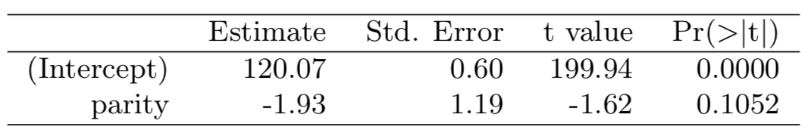
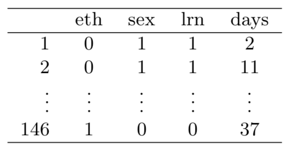
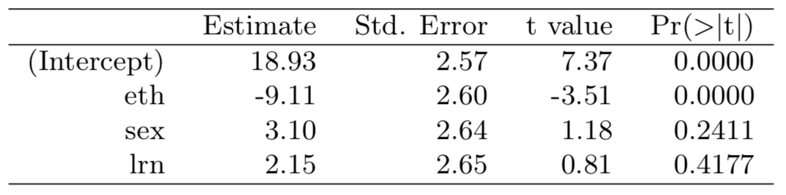
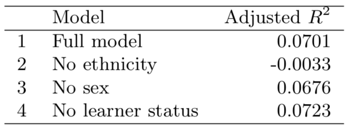
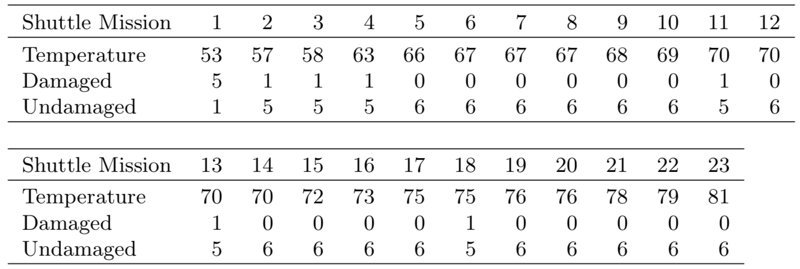
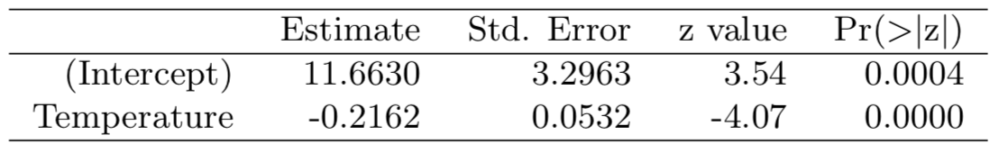
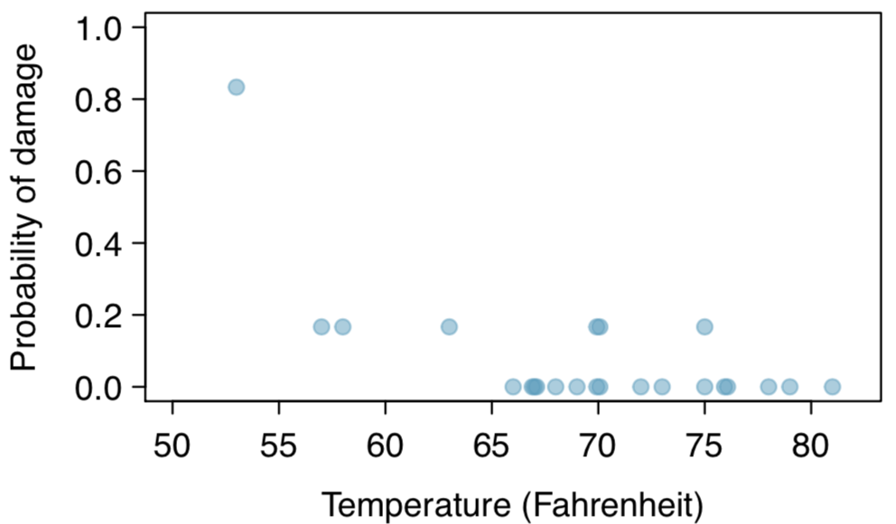

```{r setup, include=FALSE}
knitr::opts_chunk$set(echo = TRUE)
library(knitr)
library(tidyverse)
```

###8.2 - Baby weights, Part II. 

**Exercise 8.1 introduces a data set on birth weight of babies. Another variable we consider is parity, which is 0 if the child is the first born, and 1 otherwise. The summary table below shows the results of a linear regression model for predicting the average birth weight of babies, measured in ounces, from parity.**

```{r out.height="50%", out.width="50%", fig.align='center', echo=FALSE}

```

**(a) Write the equation of the regression line.**
The equation is $\hat{y}=-1.93x+120.07$.

**(b) Interpret the slope in this context, and calculate the predicted birth weight of first borns and others.**
The slope indicates that first-born babies tend to weigh more than subsequent birth-order babies.

**(c) Is there a statistically significant relationship between the average birth weight and parity?**
No, the parity variable is not statistically significant.

***

###8.4 - Absenteeism.

**Researchers interested in the relationship between absenteeism from school and certain demographic characteristics of children collected data from 146 randomly sampled students in rural New South Wales, Australia, in a particular school year. Below are three observations from this data set.**

```{r out.height="30%", out.width="30%", fig.align='center', echo=FALSE}

```

**The summary table below shows the results of a linear regression model for predicting the average number of days absent based on ethnic background (eth: 0 - aboriginal, 1 - not aboriginal), sex (sex: 0 - female, 1 - male), and learner status (lrn: 0 - average learner, 1 - slow learner).**

```{r out.height="50%", out.width="50%", fig.align='center', echo=FALSE}

```

**(a) Write the equation of the regression line.**
The equation of the regression line is: $\hat{y}=-9.11x_{\text{eth}}+3.10x_{\text{sex}}+2.15x_{\text{lrn}}+18.93$.

**(b) Interpret each one of the slopes in this context.**
Each slope represents the amount the estimated number of absentee days increases when that variable is 1. For "eth", non-aboriginal students are predicted to have 9.11 less days absent than aboriginal students. The "sex"" variable tells us that male students are predicted to have 3.10 more days absent. Finally, the "lrn" variable predicts that slower-learners are absent about 2.15 days more.

**(c) Calculate the residual for the first observation in the data set: a student who is aboriginal, male, a slow learner, and missed 2 days of school.**

We predict `r y <- 18.93 + 3.10 + 2.15
y` days absent. Since the actual was only 2, the first residual is `r y-2`.

**(d) The variance of the residuals is 240.57, and the variance of the number of absent days for all students in the data set is 264.17. Calculate the R2 and the adjusted R2. Note that there are 146 observations in the data set.**

```{r}
R2 <- 1 - (240.57/264.17)
R2a <- 1-(240.57/264.17 * 145/141)
cat("R-squared: ",round(R2,3),"\n",
      "Adjusted R-squared: ",round(R2a,3),sep="")
```

***

###8.8 - Absenteeism, Part II.
**Exercise 8.4 considers a model that predicts the number of days absent using three predictors: ethnic background (eth), gender (sex), and learner status (lrn). The table below shows the adjusted R-squared for the model as well as adjusted R-squared values for all models we evaluate in the first step of the backwards elimination process.**

```{r out.height="30%", out.width="30%", fig.align='center', echo=FALSE}

```

**Which, if any, variable should be removed from the model first?**

We should remove learner status first.

***

###8.16 - Challenger disaster, Part I.
**On January 28, 1986, a routine launch was anticipated for the Challenger space shuttle. Seventy-three seconds into the flight, disaster happened: the shuttle broke apart, killing all seven crew members on board. An investigation into the cause of the disaster focused on a critical seal called an O-ring, and it is believed that damage to these O-rings during a shuttle launch may be related to the ambient temperature during the launch. The table below summarizes observational data on O-rings for 23 shuttle missions, where the mission order is based on the temperature at the time of the launch. Temp gives the temperature in Fahrenheit, Damaged represents the number of damaged O-rings, and Undamaged represents the number of O-rings that were not damaged.**

```{r out.height="60%", out.width="60%", fig.align='center', echo=FALSE}

```

**(a) Each column of the table above represents a different shuttle mission. Examine these data and describe what you observe with respect to the relationship between temperatures and damaged O-rings.**

It appears that below a certin temperature there is a higher probability for damaged O-rings.


**(b) Failures have been coded as 1 for a damaged O-ring and 0 for an undamaged O-ring, and a logistic regression model was fit to these data. A summary of this model is given below. Describe the key components of this summary table in words.**

```{r out.height="50%", out.width="50%", fig.align='center', echo=FALSE}

```
The log odds of an O-ring failing decreases by 0.2162 per degree Fahrenheit.
 
**(c) Write out the logistic model using the point estimates of the model parameters.**

$log\bigg(\frac{\hat{p}}{1-\hat{p}}\bigg)=11.6630 -0.2162\times\text{Temp}$

```{r}
# At 0F
(exp(11.6630)/(1 + exp(11.6630)))

# At 53F
(exp(11.6630-(0.2162*53))/(1 + exp(11.6630-(0.2162*53))))

# At 81F
(exp(11.6630-(0.2162*81))/(1 + exp(11.6630-(0.2162*81))))
```

**(d) Based on the model, do you think concerns regarding O-rings are justified? Explain.**

Yes, the colder the air temperature, the higher the probability of an O-ring failing.

###8.18 - Challenger disaster, Part II.
**Exercise 8.16 introduced us to O-rings that were identified as a plausible explanation for the breakup of the Challenger space shuttle 73 seconds into takeoff in 1986. The investigation found that the ambient temperature at the time of the shuttle launch was closely related to the damage of O-rings, which are a critical component of the shuttle. See this earlier exercise if you would like to browse the original data.**

```{r out.height="50%", out.width="50%", fig.align='center', echo=FALSE}

```

**(a) The data provided in the previous exercise are shown in the plot. The logistic model fit to these data may be written as**
$$\text{log}\bigg(\frac{\hat{p}}{1-\hat{p}}\bigg)=11.6630 -0.2162\times\text{Temp}$$
**where $\hat{p}$ is the model-estimated probability that an O-ring will become damaged. Use the model to calculate the probability that an O-ring will become damaged at each of the following ambient temperatures: 51, 53, and 55 degrees Fahrenheit. The model-estimated probabilities for several additional ambient temperatures are provided below, where subscripts indicate the temperature:**

**$\hat{p}_{57}$ = 0.341 $\hat{p}_{59}$ = 0.251 $\hat{p}_{61}$ = 0.179** 
**$\hat{p}_{63}$ = 0.124 $\hat{p}_{65}$ = 0.084 $\hat{p}_{67}$ = 0.056**
**$\hat{p}_{69}$ = 0.037 $\hat{p}_{71}$ = 0.024**

```{r}
# At 51F
p51 <- round((exp(11.6630-(0.2162*51))/(1 + exp(11.6630-(0.2162*51)))),3)

# At 53F
p53 <- round((exp(11.6630-(0.2162*53))/(1 + exp(11.6630-(0.2162*53)))),3)

# At 55F
p55 <- round((exp(11.6630-(0.2162*55))/(1 + exp(11.6630-(0.2162*55)))),3)

cat("At 51F: ",p51,"\nAt 53F: ",p53,"\nAt 55F: ",p55,sep="")
```

***