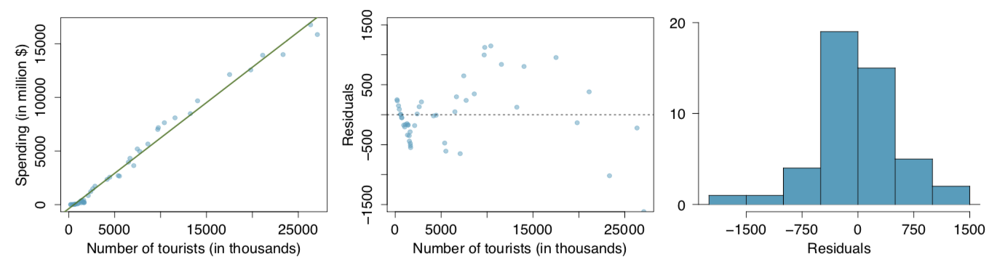
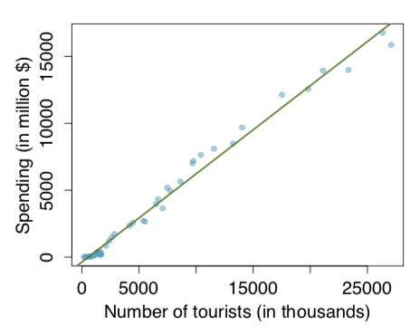
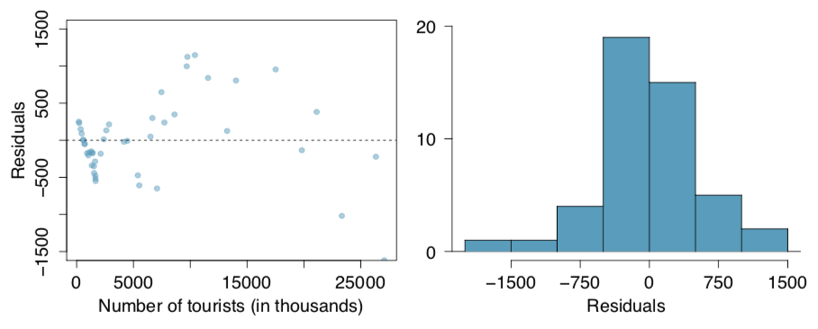

```{r setup, include=FALSE}
knitr::opts_chunk$set(echo = FALSE)
```

## Tourism Spending {.build}

The Association of Turkish Travel Agencies reports the number of foreign tourists visiting Turkey and tourist spending by year. Three plots are provided: scatterplot showing the relationship between these two variables along with the least squares fit, residual plot, and histogram of residuals.

```{r, echo=FALSE, out.width=700, fig.align='center'}

```

## {.build}

`(A) Describe the relationship between number of tourists and spending.`

```{r, echo=FALSE, out.width=300, fig.align='left'}

```

*Looking at the scatterplot, we see strong evidence for a linear relationship between number of tourists and total spending. The relationship appears to be positive.*

## {.build}

`(B) What are the explanatory and response variables?`

```{r, echo=FALSE, out.width=300, fig.align='left'}

```

*Our response variable is the spending (in millions of dollars), and our explanatory variable is the number of tourists (in thousands).*

## {.build}

`(C) Why might we want to fit a regression line to these data?`

*We may want to explain observed amounts of spending as a function of number of tourists in a year. We may also want to try and extrapolate beyond historical numbers of tourists if we are planning a large event (for example, hosting the olympics).*

## {.build}

`(D) Do the data meet the conditions required for fitting a least squares line? In addition to the scatterplot, use the residual plot and histogram to answer this question.`

```{r, echo=FALSE, out.width=600, fig.align='center', fig}

```

**Linearity:** *Yes, the scatter plot shows a pretty strong linear relationship.*

**Residuals:** *The residuals are somewhat normal.*

**Variability:** *There is some slight shift in variability.*

**Independence:** *Yes, a year over year comparison*

#End